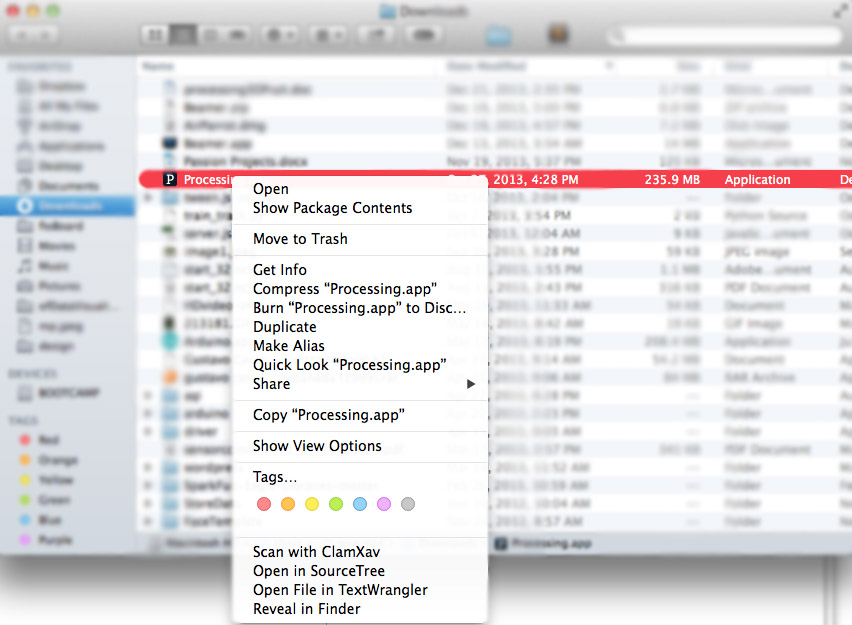
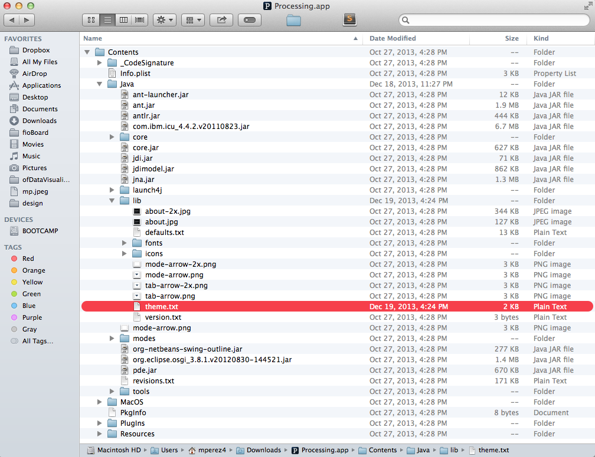
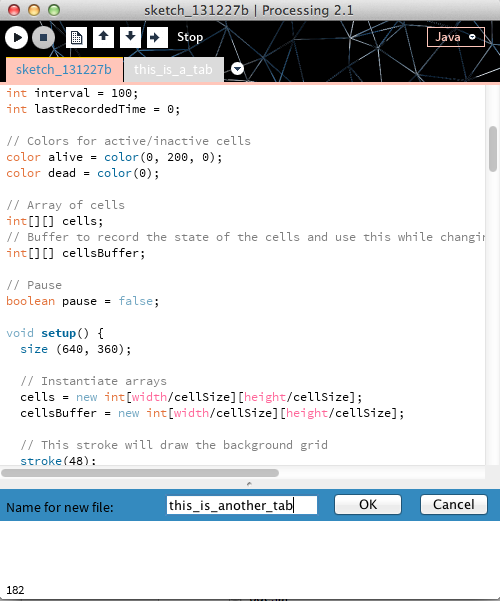
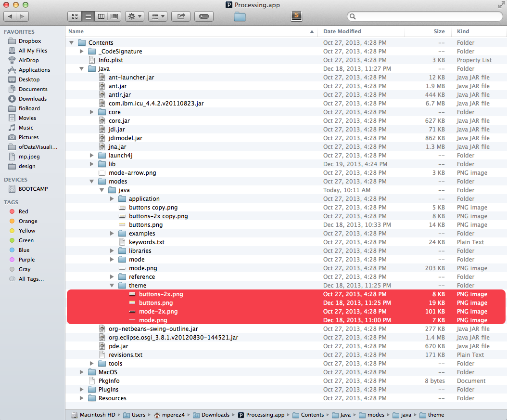
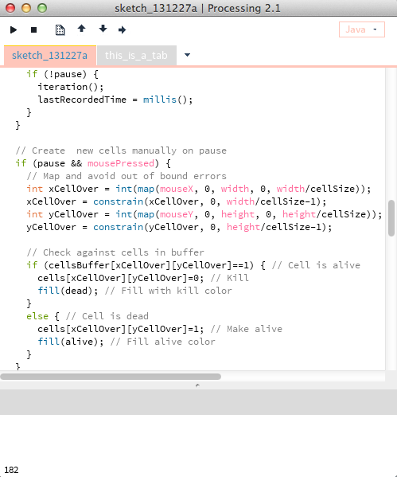
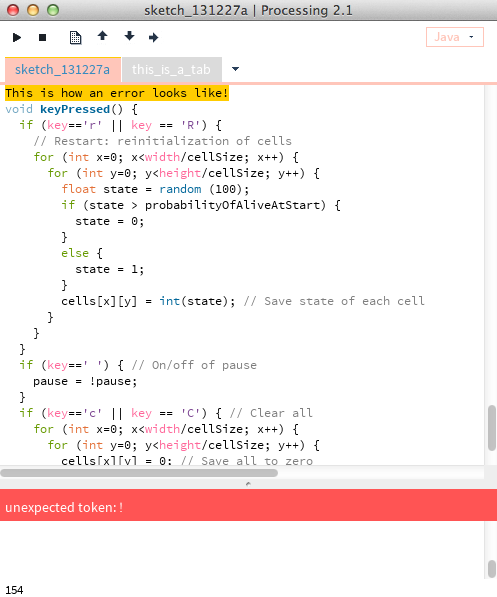
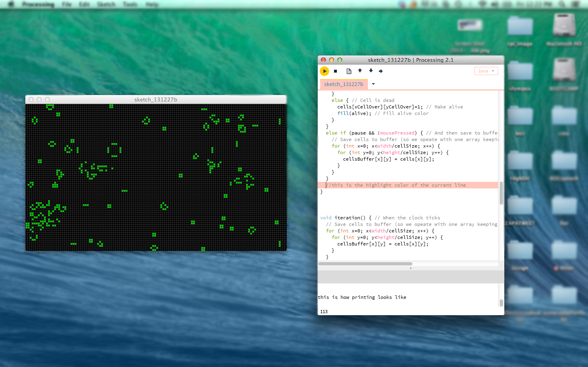

#Customize your Processing Development Environment

This tutorial will show you how to customize your Processing IDE by changing the background color, tab colors, default banner, etc etc.

======
##Package Contents

Most executable applications in Mac OS X are organized in a folder called `Contents`. Developer information, Resources, Plug-ins and dependent files are stored in there for the app to run properly. In this tutorial, we will be editing the design content only! YOU ARE AT YOUR OWN RISK IF YOU CHANGE ANYTHING ELSE. 
For this example, I am using Processing 2.1 and we will be editing the Processing JAVA mode only, though the same applies for Javascript mode, found under in your `Documents/Processing/modes` folder.<br />
<br />
The first thing we need to do is navigate to the Processing package contents. Right click on your Processing.App and click on `Show Package Contents`.
This will take us to the brains of Processing, where all the juices are stored.



Once we open the Package Contents, we can see the way in which Processing is organized internally. We can find all the images and text files in which the IDE is designed with. We will begin to change the physical appearence of Processing, primarily the colors of the IDE.  Open the file `theme.txt` found under `Contents/Java/lib/`. I use TextEdit to edit the file, though you can use whatever editor you want. 

This theme.txt file contains all the colors used to make the default IDE, and we can simply change those colors by pasting in our preferences(colors are in [hexadecimal](http://en.wikipedia.org/wiki/Hexadecimal) format). I used [this](http://www.colorpicker.com/) color picker to figure out which colors I liked and copied and pasted the #hex code. This is my current settings for my PDE:
<pre><code>
```
# STATUS
# Status messages (1 file added to sketch, errors, etc)
status.notice.fgcolor = #000000
status.notice.bgcolor = #DBDBDB
status.error.fgcolor = #ffffff
status.error.bgcolor = #FF5454
status.edit.fgcolor = #000000
status.edit.bgcolor = #348ABF
status.font = processing.sans,plain,14

# TABS
# Settings for the tab area at the top.
header.bgcolor = #DBDBDB
#header.hide.image = false # in preferences.txt
header.hide.color = #0E1B25
header.text.selected.color = #348ABF
header.text.unselected.color = #ffffff
header.text.font = processing.sans,plain,14
header.tab.selected.color = #FFC6BA
header.tab.unselected.color = #DBDBDB

# CONSOLE
# The font is handled by preferences, so its size/etc are modifiable.
console.color = #FFFFFF
console.output.color = #000000
console.error.color = #ff3000

# TOOLBAR BUTTONS
buttons.bgcolor = #000000
#buttons.hide.image = false # in preferences.txt
buttons.hide.color = #0E1B25
buttons.bgimage = true

# TOOLBAR BUTTON TEXT
buttons.status.font = processing.sans,bold,13
buttons.status.color = #ffffff

# MODE SELECTOR
mode.button.font = processing.sans,bold,13
# outline color of the mode button
mode.button.color = #FFC6BA

# LINE STATUS
# The editor line number status bar at the bottom of the screen
linestatus.color = #000000
linestatus.bgcolor = #FFFFFF
linestatus.font = processing.sans,plain,13
linestatus.height  = 20


# EDITOR - DETAILS

# foreground and background colors
editor.fgcolor = #000000
editor.bgcolor = #ffffff

# highlight for the current line
editor.linehighlight.color=#FFC6BA
# highlight for the current line
editor.linehighlight=true

# caret blinking and caret color
editor.caret.color = #333300

# color to be used for background when 'external editor' enabled
editor.external.bgcolor = #c8d2dc

# selection color
editor.selection.color = #ffcc00

# area that's not in use by the text (replaced with tildes)
editor.invalid.style = #7e7e7e,bold

# little pooties at the end of lines that show where they finish
editor.eolmarkers = false
editor.eolmarkers.color = #999999

# bracket/brace highlighting
editor.brackethighlight = true
editor.brackethighlight.color = #006699
```
</pre></code>


<br />


The theme.txt file is very straight forward and you should be able to edit it however you like. I like very simple and soft colors in my text editors. Personally, looking at a nice layout makes me happy!

##Banner and Buttons
By default, Processing has a mesh banner and button interface that is also editable. Next, we will edit those images by navigating to `Contents/Java/modes/java/theme`. There, we see the four images that compose the top banner of the Processing IDE. We can go ahead and edit those with an image-editing software like GIMP or Photoshop. I replaced the image in the `mode.png` file with just a white background, to minimalize the look of my Processing IDE. I also removed the dots under the buttons when they are in inactive status. You can add custom images for the buttons as long as you stay within the demensions of each button in the `buttons.png` file. I suggest making a copy of the original images in case that you want to revert to your changes. 


##Final Version
I made this version for this tutorial, I hope that you can now customize your own PDE!

<br />





